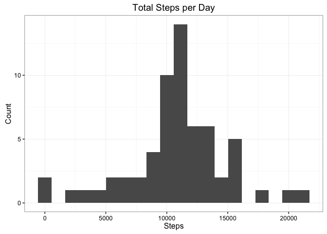
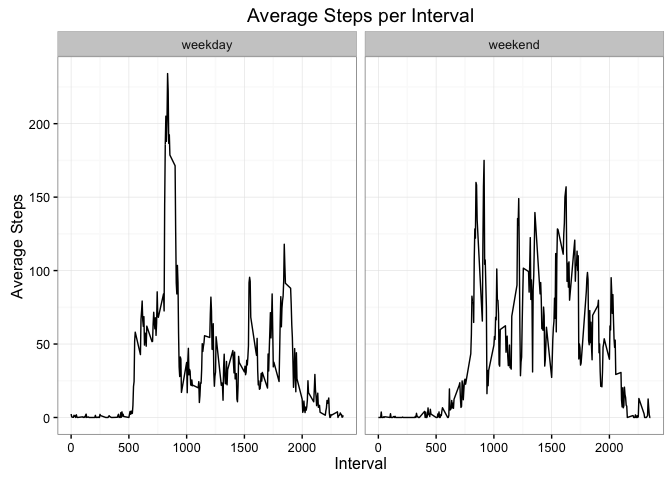

# Reproducible Research: Peer Assessment 1


## Loading and preprocessing the data

Here is the code for clearing the current workspace and unzipping the Data.


```r
## clear current workspace
rm(list = ls())

if (!file.exists("./data/activity.csv")){
    ## get the current working directory and define the data folder
    mainDir <- getwd()
    dir.create(file.path(mainDir, "data"), showWarnings = FALSE)
    
    ## unzip the data
    zipfile <- "./activity.zip"
    unzip (zipfile, exdir = "./data")
}
datafile <- paste("./data/",list.files(path = "./data")[1],sep="")
```

Next we need to load the data into R, but it helps to check with the user first to clarify that there is enough memory. Since this is a markdown file though, we'll just assume the user agrees. We'll also take the opportunity to transform the date variable into the date format. The steps and interval variables are fine as integer values. 


```r
## Calculate memory required and prompt user whether or not to proceed
memory_required <- 3 * 17568 * 8
print(paste("Memory required: ",round(memory_required/2^20,digits = 1)," MB",sep=""))
```

```
## [1] "Memory required: 0.4 MB"
```

```r
## Read the data into R
activitydata <- read.csv(datafile)

## Transform date variable to date format
activitydata$date <- as.Date(activitydata$date)
```


## What is mean total number of steps taken per day?


```r
## Select just dates and steps and filter out NA values
steps_per_day <- filter(select(activitydata, c(date, steps)), !is.na(steps))

## find the total number of steps per day
steps_per_day <- ddply(steps_per_day,c("date"),colwise(sum))
```

Now we can plot a histogram of the steps per day.

```r
g <- ggplot(aes(x=date,y=steps),data=steps_per_day)
g + geom_bar(stat="identity") + 
    labs(x = "Date", y = "Total Steps", title = "Total Steps per Day") + 
    theme_bw()
```

<!-- -->

Next we need to find the mean and median of the total steps per day.


```r
mean(steps_per_day$steps)
```

```
## [1] 10766.19
```

```r
median(steps_per_day$steps)
```

```
## [1] 10765
```

## What is the average daily activity pattern?

For this question, we need to average the steps across time interval.


```r
## Select just intervals and steps and filter out NA values
steps_per_interval <- filter(select(activitydata, c(interval, steps)), !is.na(steps))

## find the total number of steps per day
steps_per_interval <- ddply(steps_per_interval,c("interval"),colwise(mean))
```

Now we can create a line plot of the average steps per interval.


```r
g2 <- ggplot(aes(x = interval, y = steps), data = steps_per_interval)
g2 + geom_line(na.rm=TRUE) +     
    labs(x = "Interval", y = "Average Steps", title = "Average Steps per Interval") + 
    theme_bw()
```

<!-- -->

Next we need to find the interval with the maximum steps.


```r
max_int_steps <- max(steps_per_interval$steps)
steps_per_interval[steps_per_interval$steps==max_int_steps,]
```

```
##     interval    steps
## 104      835 206.1698
```

## Imputing missing values

Now we must calculate and report the total number of missing values in the dataset.


```r
sum(is.na(activitydata$steps))
```

```
## [1] 2304
```

To impute the missing data, we'll replace each missing step value with the corresponding average step value for that particular interval.


```r
## create imputed activity data set
imputed_activitydata <- activitydata

## find the indices for the missing steps
na_subs <- which(is.na(imputed_activitydata$steps))

## loop through missing values and impute the value from the interval data
for (i in na_subs) {
    sub_interval <- imputed_activitydata[i,]$interval
    imputed_activitydata[i,]$steps <- steps_per_interval[steps_per_interval$interval==sub_interval,]$steps
}
```

Now we repeat the same process from earlier to sum the imputed data by day.


```r
## Select just dates and steps and filter out NA values
imputed_steps_per_day <- filter(select(imputed_activitydata, c(date, steps)))

## find the total number of steps per day
imputed_steps_per_day <- ddply(imputed_steps_per_day,c("date"),colwise(sum))
```

Now we can plot a histogram of the imputed data steps per day.


```r
g3 <- ggplot(aes(x=date,y=steps),data=imputed_steps_per_day)
g3 + geom_bar(stat="identity") + 
    labs(x = "Date", y = "Total Steps", title = "Total Steps per Day") + 
    theme_bw()
```

<!-- -->

Next we need to find the mean and median of the total imputed data steps per day.


```r
mean(imputed_steps_per_day$steps)
```

```
## [1] 10766.19
```

```r
median(imputed_steps_per_day$steps)
```

```
## [1] 10766.19
```

## Are there differences in activity patterns between weekdays and weekends?

We start to answer this question by creating a factor variable and adding it to activitydata.


```r
weekend <- c("Saturday","Sunday")
activitydata <- mutate(activitydata, week = weekdays(date))
activitydata$week <- activitydata$week %in% weekend
activitydata$week <- factor(activitydata$week, labels = c("weekday", "weekend"))
```

Next we average the intervals across each day, while preserving the weekday and weekend factor.


```r
steps_per_interval_day <- filter(select(activitydata, c(interval, steps,week)), !is.na(steps))

## find the average steps per interval
steps_per_interval_day <- ddply(steps_per_interval_day,c("interval","week"),colwise(mean))
```

Now we create a line plot with the average steps per interval separated by the weeke factor.


```r
g4 <- ggplot(aes(x = interval, y = steps), data = steps_per_interval_day)
g4 + geom_line() + facet_grid(. ~ week) +
    labs(x = "Interval", y = "Average Steps", title = "Average Steps per Interval") + 
    theme_bw()
```

<!-- -->

